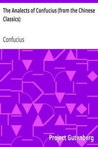

# The Analects of Confucius (from the Chinese Classics) <kbd>3330</kbd>

## Authors

 - Confucius <small>(-551 - -479)</small>

## Subjects

 - Ethics -- China
 - Philosophy, Chinese

## Download

 - https://www.gutenberg.org/files/3330/3330.zip
 - https://www.gutenberg.org/cache/epub/3330/pg3330.cover.medium.jpg
 - https://www.gutenberg.org/ebooks/3330.html.images
 - https://www.gutenberg.org/ebooks/3330.kindle.images
 - https://www.gutenberg.org/ebooks/3330.epub.images
 - https://www.gutenberg.org/ebooks/3330.txt.utf-8
 - https://www.gutenberg.org/ebooks/3330.rdf

## Book Shelves

 - Banned Books from Anne Haight's list
 - Harvard Classics
