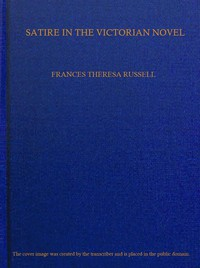

# Satire in the Victorian novel <kbd>67581</kbd>

## Authors

 - Russell, Frances Theresa <small>(1873 - 1936)</small>

## Subjects

 - English fiction -- 19th century -- History and criticism
 - Satire, English -- History and criticism
 - Thesis (Ph. D.)

## Download

 - https://www.gutenberg.org/files/67581/67581-h/67581-h.htm
 - https://www.gutenberg.org/files/67581/67581-0.zip
 - https://www.gutenberg.org/ebooks/67581.txt.utf-8
 - https://www.gutenberg.org/ebooks/67581.kindle.images
 - https://www.gutenberg.org/cache/epub/67581/pg67581.cover.medium.jpg
 - https://www.gutenberg.org/ebooks/67581.epub.images
 - https://www.gutenberg.org/ebooks/67581.rdf
 - https://www.gutenberg.org/files/67581/67581-0.txt

## Book Shelves

