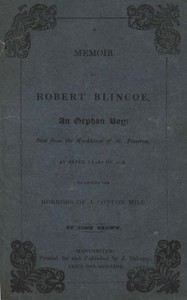

# A Memoir of Robert Blincoe, an Orphan Boy: Sent from the workhouse of St. Pancras, London, at seven years of age, to endure the horrors of a cotton-mill, through his infancy and youth, with a minute detail of his sufferings, being the first memoir of the kind published. <kbd>59127</kbd>

## Authors

 - Brown, John <small>(null - 1829)</small>

## Subjects

 - Blincoe, Robert, approximately 1792-
 - Child labor -- England -- Derbyshire
 - Cotton manufacture -- England -- Derbyshire
 - Derbyshire (England) -- Biography
 - Textile workers -- England -- Derbyshire -- Biography

## Download

 - https://www.gutenberg.org/files/59127/59127-h/59127-h.htm
 - https://www.gutenberg.org/files/59127/59127-0.txt
 - https://www.gutenberg.org/files/59127/59127-h.zip
 - https://www.gutenberg.org/cache/epub/59127/pg59127.cover.medium.jpg
 - https://www.gutenberg.org/ebooks/59127.html.images
 - https://www.gutenberg.org/ebooks/59127.rdf
 - https://www.gutenberg.org/ebooks/59127.epub.images
 - https://www.gutenberg.org/ebooks/59127.kindle.images

## Book Shelves

