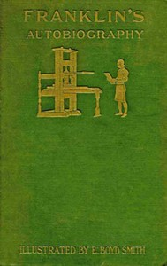

# Autobiography of Benjamin Franklin <kbd>20203</kbd>

## Authors

 - Franklin, Benjamin <small>(1706 - 1790)</small>

## Subjects

 - Franklin, Benjamin, 1706-1790
 - Statesmen -- United States -- Biography

## Download

 - https://www.gutenberg.org/files/20203/20203-8.zip
 - https://www.gutenberg.org/files/20203/20203-8.txt
 - https://www.gutenberg.org/files/20203/20203.zip
 - https://www.gutenberg.org/files/20203/20203-h.zip
 - https://www.gutenberg.org/cache/epub/20203/pg20203.cover.medium.jpg
 - https://www.gutenberg.org/ebooks/20203.html.images
 - https://www.gutenberg.org/ebooks/20203.txt.utf-8
 - https://www.gutenberg.org/ebooks/20203.epub.images
 - https://www.gutenberg.org/ebooks/20203.rdf
 - https://www.gutenberg.org/ebooks/20203.kindle.images

## Book Shelves

 - Harvard Classics
