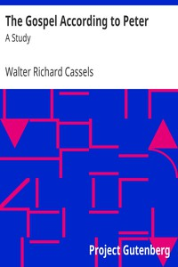

# The Gospel According to Peter: A Study <kbd>37494</kbd>

## Authors

 - Cassels, Walter Richard <small>(1826 - 1907)</small>

## Subjects

 - Bible. New Testament -- Criticism, interpretation, etc.
 - Gospel of Peter -- Criticism, interpretation, etc.
 - Peter, the Apostle, Saint

## Download

 - https://www.gutenberg.org/files/37494/37494-8.zip
 - https://www.gutenberg.org/cache/epub/37494/pg37494.cover.small.jpg
 - https://www.gutenberg.org/files/37494/37494-pdf.zip
 - https://www.gutenberg.org/files/37494/37494-0.txt
 - https://www.gutenberg.org/ebooks/37494.html.images
 - https://www.gutenberg.org/files/37494/37494-h/37494-h.html
 - https://www.gutenberg.org/files/37494/37494-8.txt
 - https://www.gutenberg.org/files/37494/37494.txt
 - https://www.gutenberg.org/ebooks/37494.epub.images
 - https://www.gutenberg.org/files/37494/37494-tei/37494-tei.tei
 - https://www.gutenberg.org/ebooks/37494.rdf
 - https://www.gutenberg.org/ebooks/37494.kindle.images

## Book Shelves

