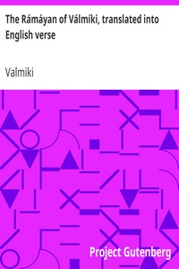

# The Rámáyan of Válmíki, translated into English verse <kbd>24869</kbd>

## Authors

 - Valmiki <small>(null - null)</small>

## Subjects

 - Epic poetry, Sanskrit -- Translations into English
 - Folklore -- India
 - Rama (Hindu deity) -- Poetry

## Download

 - https://www.gutenberg.org/files/24869/24869-h/24869-h.html
 - https://www.gutenberg.org/files/24869/24869-h.zip
 - https://www.gutenberg.org/files/24869/24869-pdf.zip
 - https://www.gutenberg.org/files/24869/24869-8.txt
 - https://www.gutenberg.org/cache/epub/24869/pg24869.cover.small.jpg
 - https://www.gutenberg.org/files/24869/24869-0.txt
 - https://www.gutenberg.org/files/24869/24869-tei/24869-tei.tei
 - https://www.gutenberg.org/ebooks/24869.html.images
 - https://www.gutenberg.org/files/24869/24869.txt
 - https://www.gutenberg.org/ebooks/24869.rdf
 - https://www.gutenberg.org/ebooks/24869.kindle.images
 - https://www.gutenberg.org/ebooks/24869.epub.images

## Book Shelves

 - India
