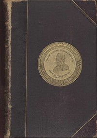

# Personal Memoirs of U. S. Grant, Complete <kbd>4367</kbd>

## Authors

 - Grant, Ulysses S. (Ulysses Simpson) <small>(1822 - 1885)</small>

## Subjects

 - Generals -- United States -- Biography
 - Grant, Ulysses S. (Ulysses Simpson), 1822-1885
 - Mexican War, 1846-1848 -- Personal narratives
 - Presidents -- United States -- Biography
 - United States -- History -- Civil War, 1861-1865 -- Campaigns
 - United States. Army -- Biography

## Download

 - https://www.gutenberg.org/files/4367/4367-h.zip
 - https://www.gutenberg.org/files/4367/4367-0.zip
 - https://www.gutenberg.org/files/4367/4367-h/4367-h.htm
 - https://www.gutenberg.org/files/4367/4367-0.txt
 - https://www.gutenberg.org/cache/epub/4367/pg4367.cover.small.jpg
 - https://www.gutenberg.org/ebooks/4367.txt.utf-8
 - https://www.gutenberg.org/ebooks/4367.kindle.images
 - https://www.gutenberg.org/ebooks/4367.epub.images
 - https://www.gutenberg.org/ebooks/4367.rdf

## Book Shelves

 - Children's History
 - US Civil War
