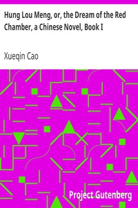

# Hung Lou Meng, or, the Dream of the Red Chamber, a Chinese Novel, Book I <kbd>9603</kbd>

## Authors

 - Cao, Xueqin <small>(1715 - 1763)</small>

## Subjects

 - Autobiographical fiction
 - Cao, Xueqin, approximately 1717-1763 -- Fiction
 - China -- History -- Qing dynasty, 1644-1912 -- Fiction
 - Domestic fiction
 - Jia, Baoyu (Fictitious character) -- Fiction

## Download

 - https://www.gutenberg.org/files/9603/9603-8.zip
 - https://www.gutenberg.org/cache/epub/9603/pg9603.cover.medium.jpg
 - https://www.gutenberg.org/files/9603/9603.zip
 - https://www.gutenberg.org/ebooks/9603.html.images
 - https://www.gutenberg.org/ebooks/9603.txt.utf-8
 - https://www.gutenberg.org/ebooks/9603.kindle.images
 - https://www.gutenberg.org/ebooks/9603.rdf
 - https://www.gutenberg.org/ebooks/9603.epub.images

## Book Shelves

