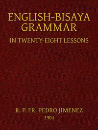

# English-Bisaya Grammar, in Twenty Eight Lessons <kbd>42026</kbd>

## Authors

## Subjects

 - Cebuano language -- Grammar

## Download

 - https://www.gutenberg.org/files/42026/42026-8.txt
 - https://www.gutenberg.org/files/42026/42026-h.zip
 - https://www.gutenberg.org/files/42026/42026-h/42026-h.htm
 - https://www.gutenberg.org/cache/epub/42026/pg42026.cover.small.jpg
 - https://www.gutenberg.org/files/42026/42026.txt
 - https://www.gutenberg.org/ebooks/42026.html.images
 - https://www.gutenberg.org/ebooks/42026.rdf
 - https://www.gutenberg.org/ebooks/42026.txt.utf-8
 - https://www.gutenberg.org/ebooks/42026.kindle.images
 - https://www.gutenberg.org/ebooks/42026.epub.images

## Book Shelves

