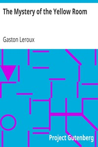

# The Mystery of the Yellow Room <kbd>1685</kbd>

## Authors

 - Leroux, Gaston <small>(1868 - 1927)</small>

## Subjects

 - Detective and mystery stories
 - Reporters and reporting -- Fiction
 - Rouletabille, Joseph (Fictitious character) -- Fiction

## Download

 - https://www.gutenberg.org/cache/epub/1685/pg1685.cover.small.jpg
 - https://www.gutenberg.org/files/1685/1685-0.txt
 - https://www.gutenberg.org/files/1685/1685-h/1685-h.htm
 - https://www.gutenberg.org/files/1685/1685.txt
 - https://www.gutenberg.org/files/1685/1685.zip
 - https://www.gutenberg.org/ebooks/1685.html.images
 - https://www.gutenberg.org/ebooks/1685.epub.images
 - https://www.gutenberg.org/ebooks/1685.rdf
 - https://www.gutenberg.org/ebooks/1685.kindle.images

## Book Shelves

 - Detective Fiction
