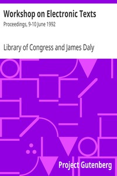

# Workshop on Electronic Texts: Proceedings, 9-10 June 1992 <kbd>53</kbd>

## Authors

 - Library of Congress <small>(null - null)</small>

## Subjects

 - Electronic books
 - Electronic publishing -- Congresses
 - Text processing (Computer science) -- Congresses

## Download

 - https://www.gutenberg.org/files/53/53.txt
 - https://www.gutenberg.org/files/53/53.zip
 - https://www.gutenberg.org/cache/epub/53/pg53.cover.small.jpg
 - https://www.gutenberg.org/ebooks/53.html.images
 - https://www.gutenberg.org/ebooks/53.kindle.images
 - https://www.gutenberg.org/ebooks/53.txt.utf-8
 - https://www.gutenberg.org/ebooks/53.rdf
 - https://www.gutenberg.org/ebooks/53.epub.images

## Book Shelves

