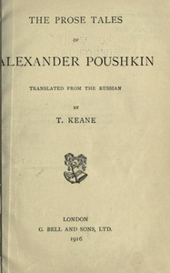

# The Prose Tales of Alexander Pushkin <kbd>55219</kbd>

## Authors

 - Pushkin, Aleksandr Sergeevich <small>(1799 - 1837)</small>

## Subjects

 - Pushkin, Aleksandr Sergeevich, 1799-1837 -- Translations into English
 - Russia -- Social life and customs -- Fiction
 - Short stories, Russian -- Translations into English

## Download

 - https://www.gutenberg.org/files/55219/55219-h.zip
 - https://www.gutenberg.org/files/55219/55219-0.zip
 - https://www.gutenberg.org/files/55219/55219-8.txt
 - https://www.gutenberg.org/files/55219/55219-h/55219.html
 - https://www.gutenberg.org/cache/epub/55219/pg55219.cover.medium.jpg
 - https://www.gutenberg.org/ebooks/55219.rdf
 - https://www.gutenberg.org/ebooks/55219.kindle.images
 - https://www.gutenberg.org/ebooks/55219.epub.images
 - https://www.gutenberg.org/ebooks/55219.txt.utf-8

## Book Shelves

