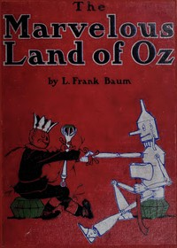

# The Marvelous Land of Oz <kbd>54</kbd>

## Authors

 - Baum, L. Frank (Lyman Frank) <small>(1856 - 1919)</small>

## Subjects

 - Conduct of life -- Juvenile fiction
 - Fantasy literature
 - Friendship -- Juvenile fiction
 - Kings and rulers -- Juvenile fiction
 - Magic -- Juvenile fiction
 - Oz (Imaginary place) -- Juvenile fiction
 - Practical jokes -- Juvenile fiction
 - Queens -- Juvenile fiction
 - Voyages and travels -- Juvenile fiction
 - Witches -- Juvenile fiction
 - Women soldiers -- Juvenile fiction
 - Youth -- Conduct of life -- Juvenile fiction

## Download

 - https://www.gutenberg.org/files/54/54-h.zip
 - https://www.gutenberg.org/files/54/54-h/54-h.htm
 - https://www.gutenberg.org/files/54/54.txt
 - https://www.gutenberg.org/ebooks/54.html.images
 - https://www.gutenberg.org/cache/epub/54/pg54.cover.small.jpg
 - https://www.gutenberg.org/ebooks/54.kindle.images
 - https://www.gutenberg.org/ebooks/54.txt.utf-8
 - https://www.gutenberg.org/ebooks/54.rdf
 - https://www.gutenberg.org/ebooks/54.epub.images

## Book Shelves

 - Children's Literature
 - Fantasy
