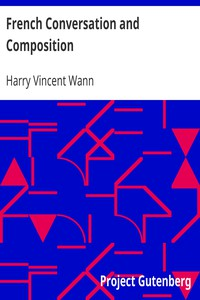

# French Conversation and Composition <kbd>11748</kbd>

## Authors

 - Wann, Harry Vincent <small>(1887 - null)</small>

## Subjects

 - French language -- Composition and exercises

## Download

 - https://www.gutenberg.org/files/11748/11748.txt
 - https://www.gutenberg.org/files/11748/11748-8.zip
 - https://www.gutenberg.org/cache/epub/11748/pg11748.cover.medium.jpg
 - https://www.gutenberg.org/ebooks/11748.html.images
 - https://www.gutenberg.org/files/11748/11748-8.txt
 - https://www.gutenberg.org/files/11748/11748-h/11748-h.htm
 - https://www.gutenberg.org/ebooks/11748.txt.utf-8
 - https://www.gutenberg.org/ebooks/11748.epub.images
 - https://www.gutenberg.org/ebooks/11748.kindle.images
 - https://www.gutenberg.org/ebooks/11748.rdf

## Book Shelves

 - FR Education et Enseignement
 - Language Education
