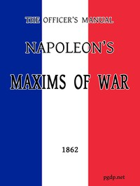

# The Officer's Manual: Napoleon's Maxims of War <kbd>50750</kbd>

## Authors

 - Napoleon I, Emperor of the French <small>(1769 - 1821)</small>

## Subjects

 - Military art and science
 - Military art and science -- Quotations, maxims, etc.
 - Napoleon I, Emperor of the French, 1769-1821 -- Knowledge -- Military art and science
 - Napoleon I, Emperor of the French, 1769-1821 -- Quotations

## Download

 - https://www.gutenberg.org/cache/epub/50750/pg50750.cover.medium.jpg
 - https://www.gutenberg.org/files/50750/50750-h.zip
 - https://www.gutenberg.org/files/50750/50750-0.txt
 - https://www.gutenberg.org/files/50750/50750-h/50750-h.htm
 - https://www.gutenberg.org/ebooks/50750.html.images
 - https://www.gutenberg.org/ebooks/50750.rdf
 - https://www.gutenberg.org/ebooks/50750.epub.images
 - https://www.gutenberg.org/ebooks/50750.kindle.images

## Book Shelves

