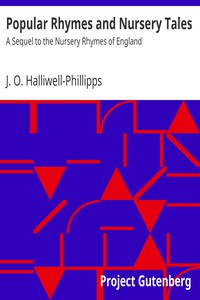

# Popular Rhymes and Nursery Tales: A Sequel to the Nursery Rhymes of England <kbd>35707</kbd>

## Authors

 - Halliwell-Phillipps, J. O. (James Orchard) <small>(1820 - 1889)</small>

## Subjects

 - Children's stories, English
 - Nursery rhymes, English

## Download

 - https://www.gutenberg.org/files/35707/35707-h/35707-h.htm
 - https://www.gutenberg.org/files/35707/35707-8.zip
 - https://www.gutenberg.org/cache/epub/35707/pg35707.cover.small.jpg
 - https://www.gutenberg.org/files/35707/35707-0.zip
 - https://www.gutenberg.org/files/35707/35707-8.txt
 - https://www.gutenberg.org/ebooks/35707.html.images
 - https://www.gutenberg.org/files/35707/35707.txt
 - https://www.gutenberg.org/ebooks/35707.kindle.images
 - https://www.gutenberg.org/ebooks/35707.rdf
 - https://www.gutenberg.org/ebooks/35707.epub.images

## Book Shelves

