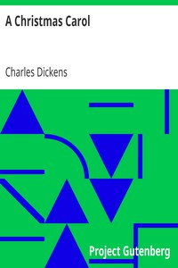

# A Christmas Carol <kbd>19337</kbd>

## Authors

 - Dickens, Charles <small>(1812 - 1870)</small>

## Subjects

 - Christmas stories
 - Ghost stories
 - London (England) -- Fiction
 - Misers -- Fiction
 - Poor families -- Fiction
 - Scrooge, Ebenezer (Fictitious character) -- Fiction
 - Sick children -- Fiction

## Download

 - https://www.gutenberg.org/files/19337/19337-8.zip
 - https://www.gutenberg.org/files/19337/19337-h.zip
 - https://www.gutenberg.org/files/19337/19337.zip
 - https://www.gutenberg.org/cache/epub/19337/pg19337.cover.small.jpg
 - https://www.gutenberg.org/ebooks/19337.html.images
 - https://www.gutenberg.org/files/19337/19337-h/19337-h.htm
 - https://www.gutenberg.org/ebooks/19337.txt.utf-8
 - https://www.gutenberg.org/ebooks/19337.epub.images
 - https://www.gutenberg.org/ebooks/19337.rdf
 - https://www.gutenberg.org/ebooks/19337.kindle.images

## Book Shelves

 - Children's Literature
 - Christmas
