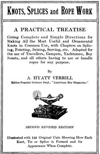

# Knots, Splices and Rope Work: A Practical Treatise Giving Complete and Simple Directions for Making All the Most Useful and Ornamental Knots in Common Use, with Chapters on Splicing, Pointing, Seizing, Serving, etc. <kbd>13510</kbd>

## Authors

 - Verrill, A. Hyatt (Alpheus Hyatt) <small>(1871 - 1954)</small>

## Subjects

 - Knots and splices

## Download

 - https://www.gutenberg.org/cache/epub/13510/pg13510.cover.small.jpg
 - https://www.gutenberg.org/files/13510/13510-h/13510-h.htm
 - https://www.gutenberg.org/files/13510/13510-h.zip
 - https://www.gutenberg.org/ebooks/13510.html.images
 - https://www.gutenberg.org/files/13510/13510.txt
 - https://www.gutenberg.org/ebooks/13510.txt.utf-8
 - https://www.gutenberg.org/ebooks/13510.epub.images
 - https://www.gutenberg.org/ebooks/13510.rdf
 - https://www.gutenberg.org/ebooks/13510.kindle.images

## Book Shelves

