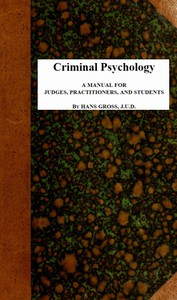

# Criminal Psychology: A Manual for Judges, Practitioners, and Students <kbd>1320</kbd>

## Authors

 - Gross, Hans <small>(1847 - 1915)</small>

## Subjects

 - Criminal anthropology
 - Criminal psychology
 - Evidence (Law)
 - Psychology, Pathological

## Download

 - https://www.gutenberg.org/cache/epub/1320/pg1320.cover.small.jpg
 - https://www.gutenberg.org/files/1320/1320-0.txt
 - https://www.gutenberg.org/files/1320/1320-0.zip
 - https://www.gutenberg.org/files/1320/1320-h/1320-h.htm
 - https://www.gutenberg.org/ebooks/1320.html.images
 - https://www.gutenberg.org/ebooks/1320.rdf
 - https://www.gutenberg.org/ebooks/1320.epub.images
 - https://www.gutenberg.org/ebooks/1320.kindle.images

## Book Shelves

 - Crime Nonfiction
 - Psychology
