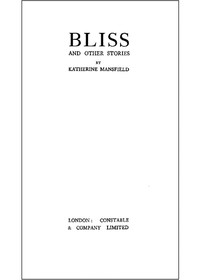

# Bliss, and Other Stories <kbd>44385</kbd>

## Authors

 - Mansfield, Katherine <small>(1888 - 1923)</small>

## Subjects

 - Europe -- Social life and customs -- Fiction
 - New Zealand -- Social life and customs -- Fiction
 - Short stories, New Zealand

## Download

 - https://www.gutenberg.org/ebooks/44385.html.images
 - https://www.gutenberg.org/files/44385/44385-0.zip
 - https://www.gutenberg.org/files/44385/44385-h.zip
 - https://www.gutenberg.org/cache/epub/44385/pg44385.cover.medium.jpg
 - https://www.gutenberg.org/ebooks/44385.txt.utf-8
 - https://www.gutenberg.org/files/44385/44385-0.txt
 - https://www.gutenberg.org/ebooks/44385.kindle.images
 - https://www.gutenberg.org/ebooks/44385.rdf
 - https://www.gutenberg.org/ebooks/44385.epub.images

## Book Shelves

