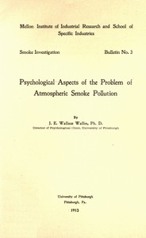

# Psychological Aspects of the Problem of Atmospheric Smoke Pollution <kbd>67675</kbd>

## Authors

 - Wallin, J. E. Wallace (John Edward Wallace) <small>(1876 - 1969)</small>

## Subjects

 - Human beings -- Effect of environment on
 - Smoke

## Download

 - https://www.gutenberg.org/ebooks/67675.epub.images
 - https://www.gutenberg.org/ebooks/67675.txt.utf-8
 - https://www.gutenberg.org/cache/epub/67675/pg67675.cover.medium.jpg
 - https://www.gutenberg.org/ebooks/67675.rdf
 - https://www.gutenberg.org/ebooks/67675.kindle.images
 - https://www.gutenberg.org/files/67675/67675-h/67675-h.htm
 - https://www.gutenberg.org/files/67675/67675-0.txt
 - https://www.gutenberg.org/files/67675/67675-0.zip

## Book Shelves

