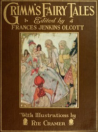

# Grimm's Fairy Tales <kbd>52521</kbd>

## Authors

 - Grimm, Wilhelm <small>(1786 - 1859)</small>
 - Grimm, Jacob <small>(1785 - 1863)</small>

## Subjects

 - Children's stories, German -- Translations into English
 - Fairy tales
 - Fairy tales -- Germany

## Download

 - https://www.gutenberg.org/files/52521/52521-0.zip
 - https://www.gutenberg.org/cache/epub/52521/pg52521.cover.small.jpg
 - https://www.gutenberg.org/files/52521/52521-h.zip
 - https://www.gutenberg.org/ebooks/52521.html.images
 - https://www.gutenberg.org/ebooks/52521.epub.images
 - https://www.gutenberg.org/ebooks/52521.rdf
 - https://www.gutenberg.org/ebooks/52521.kindle.images

## Book Shelves

