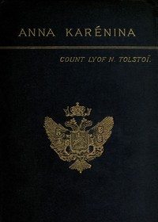

# Anna Karenina <kbd>1399</kbd>

## Authors

 - Tolstoy, Leo, graf <small>(1828 - 1910)</small>

## Subjects

 - Adultery -- Fiction
 - Didactic fiction
 - Love stories
 - Married women -- Fiction
 - Russia -- Fiction

## Download

 - https://www.gutenberg.org/cache/epub/1399/pg1399.cover.medium.jpg
 - https://www.gutenberg.org/files/1399/1399-0.txt
 - https://www.gutenberg.org/files/1399/1399-0.zip
 - https://www.gutenberg.org/files/1399/1399-h/1399-h.htm
 - https://www.gutenberg.org/ebooks/1399.html.images
 - https://www.gutenberg.org/ebooks/1399.epub.images
 - https://www.gutenberg.org/ebooks/1399.rdf
 - https://www.gutenberg.org/ebooks/1399.kindle.images

## Book Shelves

 - Best Books Ever Listings
 - Harvard Classics
 - Movie Books
