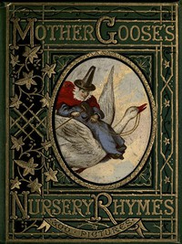

# Mother Goose's Nursery Rhymes: A Collection of Alphabets, Rhymes, Tales, and Jingles <kbd>39784</kbd>

## Authors

## Subjects

 - Alphabet rhymes
 - Children's poetry
 - Children's songs
 - Humorous poetry
 - Nursery rhymes

## Download

 - https://www.gutenberg.org/files/39784/39784-h.zip
 - https://www.gutenberg.org/files/39784/39784.zip
 - https://www.gutenberg.org/files/39784/39784-h/music/193.mid
 - https://www.gutenberg.org/cache/epub/39784/pg39784.cover.medium.jpg
 - https://www.gutenberg.org/ebooks/39784.html.images
 - https://www.gutenberg.org/ebooks/39784.txt.utf-8
 - https://www.gutenberg.org/ebooks/39784.rdf
 - https://www.gutenberg.org/ebooks/39784.kindle.images
 - https://www.gutenberg.org/ebooks/39784.epub.images

## Book Shelves

