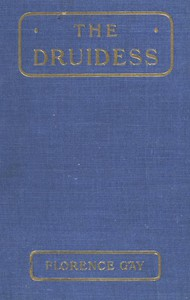

# The Druidess: A Story for Boys and Others <kbd>67674</kbd>

## Authors

 - Gay, Florence <small>(null - null)</small>

## Subjects

 - Great Britain -- History -- Anglo-Saxon period, 449-1066 -- Juvenile fiction

## Download

 - https://www.gutenberg.org/ebooks/67674.rdf
 - https://www.gutenberg.org/ebooks/67674.epub.images
 - https://www.gutenberg.org/cache/epub/67674/pg67674.cover.small.jpg
 - https://www.gutenberg.org/ebooks/67674.kindle.images
 - https://www.gutenberg.org/ebooks/67674.html.images
 - https://www.gutenberg.org/files/67674/67674-h.zip
 - https://www.gutenberg.org/ebooks/67674.txt.utf-8
 - https://www.gutenberg.org/files/67674/67674-0.txt

## Book Shelves

