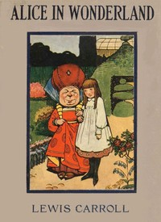

# Alice's Adventures in Wonderland <kbd>19033</kbd>

## Authors

 - Carroll, Lewis <small>(1832 - 1898)</small>

## Subjects

 - Alice (Fictitious character from Carroll) -- Juvenile fiction
 - Children's stories
 - Fantasy fiction
 - Imaginary places -- Juvenile fiction

## Download

 - https://www.gutenberg.org/files/19033/19033-h.zip
 - https://www.gutenberg.org/files/19033/19033-8.zip
 - https://www.gutenberg.org/files/19033/19033.txt
 - https://www.gutenberg.org/files/19033/19033-h/19033-h.htm
 - https://www.gutenberg.org/cache/epub/19033/pg19033.cover.medium.jpg
 - https://www.gutenberg.org/ebooks/19033.html.images
 - https://www.gutenberg.org/ebooks/19033.txt.utf-8
 - https://www.gutenberg.org/ebooks/19033.epub.images
 - https://www.gutenberg.org/ebooks/19033.rdf
 - https://www.gutenberg.org/ebooks/19033.kindle.images

## Book Shelves

 - Children's Literature
