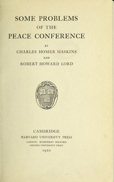

# Some Problems of the Peace Conference <kbd>67688</kbd>

## Authors

 - Haskins, Charles Homer <small>(1870 - 1937)</small>
 - Lord, Robert Howard <small>(1885 - 1954)</small>

## Subjects

 - Paris Peace Conference (1919-1920)
 - World War, 1914-1918 -- Territorial questions

## Download

 - https://www.gutenberg.org/files/67688/67688-h.zip
 - https://www.gutenberg.org/ebooks/67688.txt.utf-8
 - https://www.gutenberg.org/ebooks/67688.kindle.images
 - https://www.gutenberg.org/ebooks/67688.html.images
 - https://www.gutenberg.org/ebooks/67688.epub.images
 - https://www.gutenberg.org/cache/epub/67688/pg67688.cover.medium.jpg
 - https://www.gutenberg.org/ebooks/67688.rdf
 - https://www.gutenberg.org/files/67688/67688-0.txt

## Book Shelves

