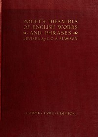

# Roget's Thesaurus <kbd>22</kbd>

## Authors

 - Roget, Peter Mark <small>(1779 - 1869)</small>

## Subjects

 - English language -- Synonyms and antonyms

## Download

 - https://www.gutenberg.org/files/22/22-0.zip
 - https://www.gutenberg.org/files/22/22-h/22-h.htm
 - https://www.gutenberg.org/files/22/22-0.txt
 - https://www.gutenberg.org/cache/epub/22/pg22.cover.medium.jpg
 - https://www.gutenberg.org/ebooks/22.html.images
 - https://www.gutenberg.org/ebooks/22.kindle.images
 - https://www.gutenberg.org/ebooks/22.rdf
 - https://www.gutenberg.org/ebooks/22.epub.images

## Book Shelves

 - Reference
