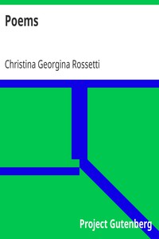

# Poems <kbd>19188</kbd>

## Authors

 - Rossetti, Christina Georgina <small>(1830 - 1894)</small>

## Subjects

 - English poetry

## Download

 - https://www.gutenberg.org/files/19188/19188-8.zip
 - https://www.gutenberg.org/cache/epub/19188/pg19188.cover.small.jpg
 - https://www.gutenberg.org/files/19188/19188-h/19188-h.htm
 - https://www.gutenberg.org/files/19188/19188.zip
 - https://www.gutenberg.org/files/19188/19188-8.txt
 - https://www.gutenberg.org/ebooks/19188.html.images
 - https://www.gutenberg.org/ebooks/19188.txt.utf-8
 - https://www.gutenberg.org/ebooks/19188.epub.images
 - https://www.gutenberg.org/ebooks/19188.rdf
 - https://www.gutenberg.org/ebooks/19188.kindle.images

## Book Shelves

