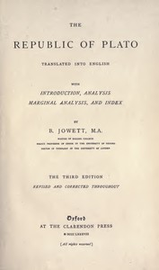

# The Republic of Plato <kbd>55201</kbd>

## Authors

 - Plato <small>(-428 - -348)</small>

## Subjects

 - Justice -- Early works to 1800
 - Political science -- Early works to 1800
 - Utopias -- Early works to 1800

## Download

 - https://www.gutenberg.org/files/55201/55201-8.zip
 - https://www.gutenberg.org/files/55201/55201-8.txt
 - https://www.gutenberg.org/cache/epub/55201/pg55201.cover.small.jpg
 - https://www.gutenberg.org/files/55201/55201-h.zip
 - https://www.gutenberg.org/ebooks/55201.html.images
 - https://www.gutenberg.org/ebooks/55201.rdf
 - https://www.gutenberg.org/ebooks/55201.kindle.images
 - https://www.gutenberg.org/ebooks/55201.epub.images
 - https://www.gutenberg.org/ebooks/55201.txt.utf-8

## Book Shelves

