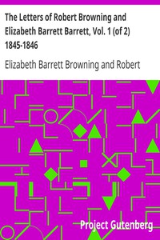

# The Letters of Robert Browning and Elizabeth Barrett Barrett, Vol. 1 (of 2) 1845-1846 <kbd>16182</kbd>

## Authors

 - Browning, Robert <small>(1812 - 1889)</small>
 - Browning, Elizabeth Barrett <small>(1806 - 1861)</small>

## Subjects

 - Browning, Elizabeth Barrett, 1806-1861 -- Correspondence
 - Browning, Robert, 1812-1889 -- Correspondence
 - Poets, English -- 19th century -- Correspondence

## Download

 - https://www.gutenberg.org/files/16182/16182-h.zip
 - https://www.gutenberg.org/files/16182/16182.zip
 - https://www.gutenberg.org/cache/epub/16182/pg16182.cover.small.jpg
 - https://www.gutenberg.org/files/16182/16182-8.txt
 - https://www.gutenberg.org/ebooks/16182.html.images
 - https://www.gutenberg.org/ebooks/16182.txt.utf-8
 - https://www.gutenberg.org/ebooks/16182.epub.images
 - https://www.gutenberg.org/ebooks/16182.rdf
 - https://www.gutenberg.org/ebooks/16182.kindle.images

## Book Shelves

