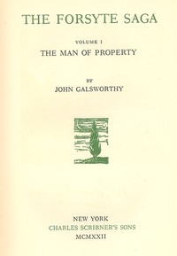

# The Forsyte Saga, Volume I.: The Man Of Property <kbd>2559</kbd>

## Authors

 - Galsworthy, John <small>(1867 - 1933)</small>

## Subjects

 - Domestic fiction
 - England -- Social life and customs -- 19th century -- Fiction
 - England -- Social life and customs -- 20th century -- Fiction
 - Families -- England -- Fiction
 - Forsyte family (Fictitious characters) -- Fiction
 - Middle class -- England -- Fiction
 - Women -- England -- Fiction

## Download

 - https://www.gutenberg.org/files/2559/2559-h/2559-h.htm
 - https://www.gutenberg.org/files/2559/2559-h.zip
 - https://www.gutenberg.org/files/2559/2559.zip
 - https://www.gutenberg.org/cache/epub/2559/pg2559.cover.small.jpg
 - https://www.gutenberg.org/files/2559/2559-0.txt
 - https://www.gutenberg.org/ebooks/2559.html.images
 - https://www.gutenberg.org/ebooks/2559.rdf
 - https://www.gutenberg.org/ebooks/2559.epub.images
 - https://www.gutenberg.org/ebooks/2559.kindle.images

## Book Shelves

