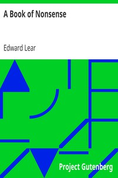

# A Book of Nonsense <kbd>13646</kbd>

## Authors

 - Lear, Edward <small>(1812 - 1888)</small>

## Subjects

 - Children's poetry, English
 - Humorous poetry, English
 - Limericks, Juvenile
 - Nonsense verses, English

## Download

 - https://www.gutenberg.org/cache/epub/13646/pg13646.cover.small.jpg
 - https://www.gutenberg.org/files/13646/13646.zip
 - https://www.gutenberg.org/files/13646/13646-8.zip
 - https://www.gutenberg.org/files/13646/13646-h/13646-h.htm
 - https://www.gutenberg.org/files/13646/13646-8.txt
 - https://www.gutenberg.org/ebooks/13646.html.images
 - https://www.gutenberg.org/ebooks/13646.txt.utf-8
 - https://www.gutenberg.org/ebooks/13646.epub.images
 - https://www.gutenberg.org/ebooks/13646.rdf
 - https://www.gutenberg.org/ebooks/13646.kindle.images

## Book Shelves

 - Children's Picture Books
 - Children's Verse
 - Humor
