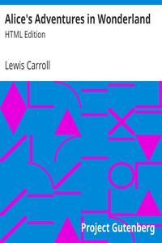

# Alice's Adventures in Wonderland: HTML Edition <kbd>928</kbd>

## Authors

 - Carroll, Lewis <small>(1832 - 1898)</small>

## Subjects

 - Alice (Fictitious character from Carroll) -- Juvenile fiction
 - Children's stories
 - Fantasy fiction
 - Imaginary places -- Juvenile fiction

## Download

 - https://www.gutenberg.org/cache/epub/928/pg928.cover.medium.jpg
 - https://www.gutenberg.org/files/928/928-h.zip
 - https://www.gutenberg.org/ebooks/928.kindle.images
 - https://www.gutenberg.org/ebooks/928.rdf
 - https://www.gutenberg.org/ebooks/928.epub.images

## Book Shelves

 - Best Books Ever Listings
 - Children's Literature
