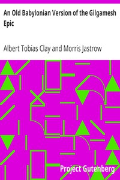

# An Old Babylonian Version of the Gilgamesh Epic <kbd>11000</kbd>

## Authors

 - Clay, Albert Tobias <small>(1866 - 1925)</small>
 - Jastrow, Morris <small>(1861 - 1921)</small>

## Subjects

 - Epic poetry, Assyro-Babylonian

## Download

 - https://www.gutenberg.org/files/11000/11000-8.zip
 - https://www.gutenberg.org/files/11000/11000-h/11000-h.htm
 - https://www.gutenberg.org/cache/epub/11000/pg11000.cover.small.jpg
 - https://www.gutenberg.org/files/11000/11000-8.txt
 - https://www.gutenberg.org/ebooks/11000.txt.utf-8
 - https://www.gutenberg.org/ebooks/11000.epub.images
 - https://www.gutenberg.org/ebooks/11000.rdf
 - https://www.gutenberg.org/ebooks/11000.kindle.images

## Book Shelves

 - Best Books Ever Listings
