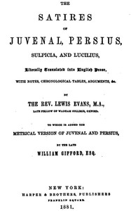

# The Satires of Juvenal, Persius, Sulpicia, and Lucilius: Literally translated into English prose, with notes, chronological tables, arguments, &c. <kbd>50657</kbd>

## Authors

 - Persius <small>(null - null)</small>
 - Sulpicia <small>(null - null)</small>
 - Juvenal <small>(null - null)</small>
 - Lucilius, Gaius <small>(null - null)</small>

## Subjects

 - Juvenal -- Translations into English
 - Verse satire, Latin -- Translations into English

## Download

 - https://www.gutenberg.org/files/50657/50657-0.zip
 - https://www.gutenberg.org/files/50657/50657-0.txt
 - https://www.gutenberg.org/files/50657/50657-h.zip
 - https://www.gutenberg.org/cache/epub/50657/pg50657.cover.small.jpg
 - https://www.gutenberg.org/ebooks/50657.html.images
 - https://www.gutenberg.org/ebooks/50657.rdf
 - https://www.gutenberg.org/ebooks/50657.epub.images
 - https://www.gutenberg.org/ebooks/50657.kindle.images

## Book Shelves

