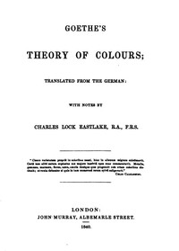

# Goethe's Theory of Colours <kbd>50572</kbd>

## Authors

 - Goethe, Johann Wolfgang von <small>(1749 - 1832)</small>

## Subjects

 - Color

## Download

 - https://www.gutenberg.org/cache/epub/50572/pg50572.cover.medium.jpg
 - https://www.gutenberg.org/files/50572/50572-h.zip
 - https://www.gutenberg.org/files/50572/50572-h/50572-h.htm
 - https://www.gutenberg.org/files/50572/50572-0.txt
 - https://www.gutenberg.org/ebooks/50572.html.images
 - https://www.gutenberg.org/ebooks/50572.rdf
 - https://www.gutenberg.org/ebooks/50572.epub.images
 - https://www.gutenberg.org/ebooks/50572.kindle.images

## Book Shelves

