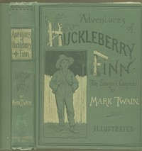

# Adventures of Huckleberry Finn, Chapters 01 to 05 <kbd>7100</kbd>

## Authors

 - Twain, Mark <small>(1835 - 1910)</small>

## Subjects

 - Adventure stories
 - Bildungsromans
 - Boys -- Fiction
 - Finn, Huckleberry (Fictitious character) -- Fiction
 - Fugitive slaves -- Fiction
 - Humorous stories
 - Male friendship -- Fiction
 - Mississippi River -- Fiction
 - Missouri -- Fiction
 - Race relations -- Fiction
 - Runaway children -- Fiction

## Download

 - https://www.gutenberg.org/files/7100/7100-h/7100-h.htm
 - https://www.gutenberg.org/files/7100/7100.zip
 - https://www.gutenberg.org/cache/epub/7100/pg7100.cover.small.jpg
 - https://www.gutenberg.org/files/7100/7100.txt
 - https://www.gutenberg.org/ebooks/7100.html.images
 - https://www.gutenberg.org/ebooks/7100.kindle.images
 - https://www.gutenberg.org/ebooks/7100.rdf
 - https://www.gutenberg.org/ebooks/7100.epub.images
 - https://www.gutenberg.org/ebooks/7100.txt.utf-8

## Book Shelves

