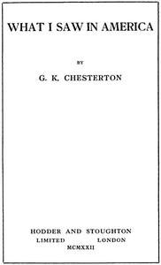

# What I Saw in America <kbd>27250</kbd>

## Authors

 - Chesterton, G. K. (Gilbert Keith) <small>(1874 - 1936)</small>

## Subjects

 - Chesterton, G. K. (Gilbert Keith), 1874-1936 -- Travel -- United States
 - National characteristics, American
 - United States -- Civilization -- 1918-1945
 - United States -- Description and travel
 - United States -- Social life and customs -- 1918-1945

## Download

 - https://www.gutenberg.org/files/27250/27250-h.zip
 - https://www.gutenberg.org/files/27250/27250-h/27250-h.htm
 - https://www.gutenberg.org/files/27250/27250-8.txt
 - https://www.gutenberg.org/cache/epub/27250/pg27250.cover.medium.jpg
 - https://www.gutenberg.org/ebooks/27250.html.images
 - https://www.gutenberg.org/files/27250/27250.txt
 - https://www.gutenberg.org/ebooks/27250.kindle.images
 - https://www.gutenberg.org/ebooks/27250.txt.utf-8
 - https://www.gutenberg.org/ebooks/27250.epub.images
 - https://www.gutenberg.org/ebooks/27250.rdf

## Book Shelves

 - Travel
