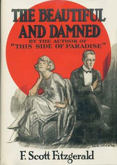

# The Beautiful and Damned <kbd>9830</kbd>

## Authors

 - Fitzgerald, F. Scott (Francis Scott) <small>(1896 - 1940)</small>

## Subjects

 - Alcoholics -- Fiction
 - Domestic fiction
 - Inheritance and succession -- Fiction
 - Married people -- Fiction
 - New York (N.Y.) -- Fiction
 - Psychological fiction
 - Socialites -- Fiction
 - Young men -- Fiction

## Download

 - https://www.gutenberg.org/files/9830/9830.zip
 - https://www.gutenberg.org/files/9830/9830-h/9830-h.htm
 - https://www.gutenberg.org/files/9830/9830.txt
 - https://www.gutenberg.org/files/9830/9830-8.zip
 - https://www.gutenberg.org/cache/epub/9830/pg9830.cover.small.jpg
 - https://www.gutenberg.org/files/9830/9830-0.txt
 - https://www.gutenberg.org/ebooks/9830.html.images
 - https://www.gutenberg.org/ebooks/9830.kindle.images
 - https://www.gutenberg.org/ebooks/9830.rdf
 - https://www.gutenberg.org/ebooks/9830.epub.images

## Book Shelves

