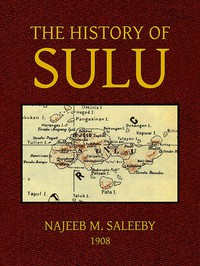

# The History of Sulu <kbd>41771</kbd>

## Authors

 - Saleeby, Najeeb M. (Najeeb Mitry) <small>(1870 - null)</small>

## Subjects

 - Mindanao Island (Philippines) -- History
 - Muslims -- Philippines
 - Sulu Archipelago (Philippines) -- History

## Download

 - https://www.gutenberg.org/files/41771/41771-8.zip
 - https://www.gutenberg.org/files/41771/41771.zip
 - https://www.gutenberg.org/cache/epub/41771/pg41771.cover.small.jpg
 - https://www.gutenberg.org/files/41771/41771-h/41771-h.htm
 - https://www.gutenberg.org/ebooks/41771.html.images
 - https://www.gutenberg.org/files/41771/41771-8.txt
 - https://www.gutenberg.org/ebooks/41771.kindle.images
 - https://www.gutenberg.org/ebooks/41771.txt.utf-8
 - https://www.gutenberg.org/ebooks/41771.rdf
 - https://www.gutenberg.org/ebooks/41771.epub.images

## Book Shelves

