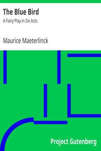

# The Blue Bird: A Fairy Play in Six Acts <kbd>8606</kbd>

## Authors

 - Maeterlinck, Maurice <small>(1862 - 1949)</small>

## Subjects

 - Fairy plays
 - French drama -- Translations into English

## Download

 - https://www.gutenberg.org/files/8606/8606-8.zip
 - https://www.gutenberg.org/files/8606/8606-h.zip
 - https://www.gutenberg.org/files/8606/8606-8.txt
 - https://www.gutenberg.org/cache/epub/8606/pg8606.cover.medium.jpg
 - https://www.gutenberg.org/files/8606/8606.txt
 - https://www.gutenberg.org/ebooks/8606.html.images
 - https://www.gutenberg.org/ebooks/8606.rdf
 - https://www.gutenberg.org/ebooks/8606.kindle.images
 - https://www.gutenberg.org/ebooks/8606.epub.images
 - https://www.gutenberg.org/ebooks/8606.txt.utf-8

## Book Shelves

