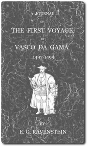

# A Journal of the First Voyage of  Vasco da Gama 1497-1499 <kbd>46440</kbd>

## Authors

## Subjects

 - Africa -- Description and travel
 - Gama, Vasco da, 1469-1524
 - India -- Description and travel
 - Voyages and travels

## Download

 - https://www.gutenberg.org/files/46440/46440-h.zip
 - https://www.gutenberg.org/files/46440/46440-0.zip
 - https://www.gutenberg.org/cache/epub/46440/pg46440.cover.medium.jpg
 - https://www.gutenberg.org/files/46440/46440.zip
 - https://www.gutenberg.org/files/46440/46440-8.txt
 - https://www.gutenberg.org/ebooks/46440.html.images
 - https://www.gutenberg.org/ebooks/46440.kindle.images
 - https://www.gutenberg.org/ebooks/46440.rdf
 - https://www.gutenberg.org/ebooks/46440.epub.images
 - https://www.gutenberg.org/files/46440/46440-0.txt

## Book Shelves

