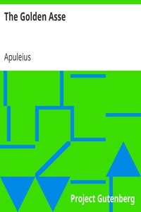

# The Golden Asse <kbd>1666</kbd>

## Authors

 - Apuleius <small>(null - null)</small>

## Subjects

 - Classical literature
 - Metamorphosis -- Fiction

## Download

 - https://www.gutenberg.org/files/1666/1666-h.zip
 - https://www.gutenberg.org/cache/epub/1666/pg1666.cover.small.jpg
 - https://www.gutenberg.org/ebooks/1666.html.images
 - https://www.gutenberg.org/files/1666/1666-0.txt
 - https://www.gutenberg.org/ebooks/1666.rdf
 - https://www.gutenberg.org/ebooks/1666.epub.images
 - https://www.gutenberg.org/ebooks/1666.kindle.images
 - https://www.gutenberg.org/files/1666/1666-h/1666-h.htm

## Book Shelves

 - Banned Books from Anne Haight's list
 - Classical Antiquity
