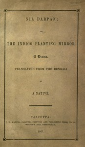

# Nil Darpan; or, The Indigo Planting Mirror, A Drama.: Translated from the Bengali by a Native. <kbd>54027</kbd>

## Authors

 - Mitra, Dinabandhu <small>(1829 - 1874)</small>

## Subjects

 - Indigo industry -- India -- Bengal -- Drama

## Download

 - https://www.gutenberg.org/files/54027/54027-h/54027-h.htm
 - https://www.gutenberg.org/files/54027/54027-h.zip
 - https://www.gutenberg.org/files/54027/54027-0.txt
 - https://www.gutenberg.org/cache/epub/54027/pg54027.cover.small.jpg
 - https://www.gutenberg.org/ebooks/54027.html.images
 - https://www.gutenberg.org/ebooks/54027.rdf
 - https://www.gutenberg.org/ebooks/54027.kindle.images
 - https://www.gutenberg.org/ebooks/54027.epub.images

## Book Shelves

