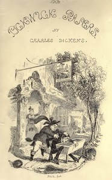

# The Pickwick Papers <kbd>580</kbd>

## Authors

 - Dickens, Charles <small>(1812 - 1870)</small>

## Subjects

 - England -- Fiction
 - Humorous stories
 - Male friendship -- Fiction
 - Men -- Societies and clubs -- Fiction

## Download

 - https://www.gutenberg.org/files/580/580-h/580-h.htm
 - https://www.gutenberg.org/files/580/580.zip
 - https://www.gutenberg.org/cache/epub/580/pg580.cover.medium.jpg
 - https://www.gutenberg.org/files/580/580.txt
 - https://www.gutenberg.org/files/580/580-0.txt
 - https://www.gutenberg.org/ebooks/580.html.images
 - https://www.gutenberg.org/ebooks/580.kindle.images
 - https://www.gutenberg.org/ebooks/580.rdf
 - https://www.gutenberg.org/ebooks/580.epub.images

## Book Shelves

 - Best Books Ever Listings
