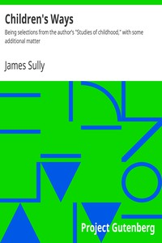

# Children's Ways: Being selections from the author’s "Studies of childhood," with some additional matter <kbd>37020</kbd>

## Authors

 - Sully, James <small>(1842 - 1923)</small>

## Subjects

 - Child development
 - Child psychology

## Download

 - https://www.gutenberg.org/files/37020/37020-8.zip
 - https://www.gutenberg.org/files/37020/37020-h.zip
 - https://www.gutenberg.org/cache/epub/37020/pg37020.cover.medium.jpg
 - https://www.gutenberg.org/files/37020/37020.txt
 - https://www.gutenberg.org/ebooks/37020.html.images
 - https://www.gutenberg.org/ebooks/37020.rdf
 - https://www.gutenberg.org/ebooks/37020.epub.images
 - https://www.gutenberg.org/ebooks/37020.kindle.images
 - https://www.gutenberg.org/ebooks/37020.txt.utf-8

## Book Shelves

