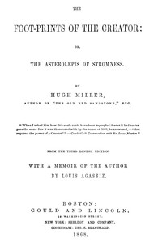

# The Foot-prints of the Creator: or, The Asterolepis of Stromness <kbd>67527</kbd>

## Authors

 - Miller, Hugh <small>(1802 - 1856)</small>

## Subjects

 - Asterolepididae
 - Creation
 - Evolution
 - Fishes, Fossil
 - Geology -- Scotland
 - Miller, Hugh, 1802-1856
 - Paleontology -- Scotland

## Download

 - https://www.gutenberg.org/ebooks/67527.epub.images
 - https://www.gutenberg.org/ebooks/67527.txt.utf-8
 - https://www.gutenberg.org/ebooks/67527.rdf
 - https://www.gutenberg.org/files/67527/67527-0.zip
 - https://www.gutenberg.org/ebooks/67527.html.images
 - https://www.gutenberg.org/cache/epub/67527/pg67527.cover.medium.jpg
 - https://www.gutenberg.org/ebooks/67527.kindle.images
 - https://www.gutenberg.org/files/67527/67527-0.txt

## Book Shelves

