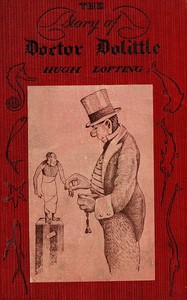

# The Story of Doctor Dolittle <kbd>501</kbd>

## Authors

 - Lofting, Hugh <small>(1886 - 1947)</small>

## Subjects

 - Animals -- Juvenile fiction
 - Fantasy literature
 - Human-animal communication -- Juvenile fiction

## Download

 - https://www.gutenberg.org/files/501/501-0.txt
 - https://www.gutenberg.org/files/501/501-0.zip
 - https://www.gutenberg.org/files/501/501-h/501-h.htm
 - https://www.gutenberg.org/cache/epub/501/pg501.cover.small.jpg
 - https://www.gutenberg.org/ebooks/501.html.images
 - https://www.gutenberg.org/ebooks/501.kindle.images
 - https://www.gutenberg.org/ebooks/501.rdf
 - https://www.gutenberg.org/ebooks/501.epub.images

## Book Shelves

 - Children's Literature
