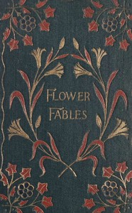

# Flower Fables <kbd>163</kbd>

## Authors

 - Alcott, Louisa May <small>(1832 - 1888)</small>

## Subjects

 - Children's stories, American
 - Fairies -- Juvenile poetry
 - Fairy tales -- United States
 - Flowers -- Juvenile fiction
 - Flowers -- Juvenile poetry
 - Short stories

## Download

 - https://www.gutenberg.org/cache/epub/163/pg163.cover.small.jpg
 - https://www.gutenberg.org/files/163/163-0.zip
 - https://www.gutenberg.org/ebooks/163.html.images
 - https://www.gutenberg.org/files/163/163-h/163-h.htm
 - https://www.gutenberg.org/ebooks/163.kindle.images
 - https://www.gutenberg.org/ebooks/163.rdf
 - https://www.gutenberg.org/ebooks/163.epub.images

## Book Shelves

 - Children's Literature
